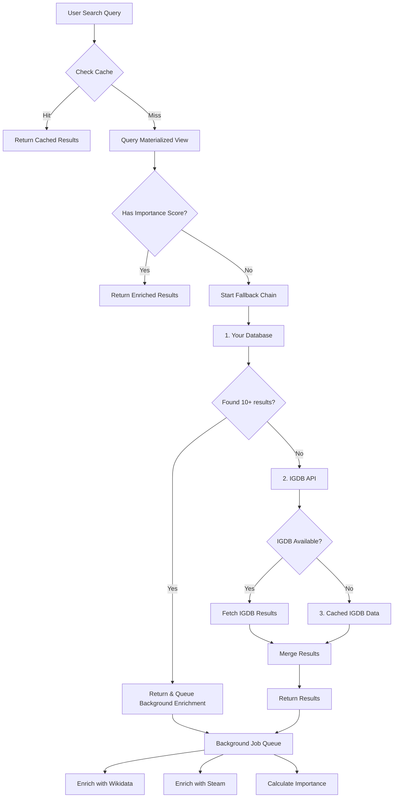

# 🔄 Fallback System Design & Platform Detection

## 📊 **Data Source Priority & Fallback Chain**

### **Search Flow Architecture**



## 🎯 **Fallback Priority Order**

### **Primary Search (0ms added latency)**
```typescript
// Level 1: Pre-calculated importance scores
async function searchWithImportance(query: string) {
  // This is ALWAYS tried first - it's just a DB query
  const { data, error } = await supabase
    .from('game_search_optimized')  // Materialized view
    .select('*')
    .textSearch('search_vector', query)
    .order('importance_score', { ascending: false })
    .limit(50);
  
  if (data && data.length >= 10) {
    return { 
      results: data, 
      source: 'optimized',
      fallbackUsed: false 
    };
  }
  
  // Not enough results, start fallback chain
  return fallbackSearch(query, data || []);
}
```

### **Fallback Chain (when importance data is incomplete)**

```typescript
// Fallback priority order
const FALLBACK_CHAIN = [
  {
    name: 'database_basic',
    timeout: 200,
    minResults: 5,
    handler: searchDatabaseBasic
  },
  {
    name: 'igdb_realtime',
    timeout: 800,
    minResults: 10,
    handler: searchIGDBRealtime
  },
  {
    name: 'igdb_cached',
    timeout: 100,
    minResults: 5,
    handler: searchIGDBCached
  },
  {
    name: 'fuzzy_search',
    timeout: 300,
    minResults: 3,
    handler: searchFuzzyFallback
  }
];

async function fallbackSearch(
  query: string, 
  existingResults: Game[] = []
): Promise<SearchResult> {
  let allResults = [...existingResults];
  let sourcesUsed = [];
  
  for (const source of FALLBACK_CHAIN) {
    // Skip if we have enough results
    if (allResults.length >= 20) break;
    
    try {
      // Try with timeout
      const results = await Promise.race([
        source.handler(query),
        timeout(source.timeout)
      ]);
      
      if (results && results.length > 0) {
        allResults = mergeAndDedupe(allResults, results);
        sourcesUsed.push(source.name);
        
        // Queue background enrichment for these results
        queueEnrichment(results);
      }
      
      if (allResults.length >= source.minResults) {
        // Acceptable results, but continue to try to get more
        continue;
      }
    } catch (error) {
      console.warn(`Fallback ${source.name} failed:`, error);
      // Continue to next fallback
    }
  }
  
  return {
    results: allResults,
    source: sourcesUsed.join('+'),
    fallbackUsed: true
  };
}
```

## 🎮 **Platform Detection System**

### **Platform Categories**
```typescript
enum PlatformCategory {
  PC_ONLY = 'pc_only',
  CONSOLE_ONLY = 'console_only',
  MULTI_PLATFORM = 'multi_platform',
  MOBILE_ONLY = 'mobile_only',
  RETRO = 'retro'
}

// Platform mapping
const PLATFORM_MAPPINGS = {
  // PC Platforms
  pc: ['PC (Windows)', 'Mac', 'Linux', 'PC (Microsoft Windows)', 'PC DOS', 'Steam'],
  
  // Modern Consoles
  playstation: ['PlayStation 5', 'PlayStation 4', 'PlayStation 3', 'PlayStation 2', 'PlayStation'],
  xbox: ['Xbox Series X|S', 'Xbox Series X', 'Xbox Series S', 'Xbox One', 'Xbox 360', 'Xbox'],
  nintendo_modern: ['Nintendo Switch', 'Wii U', 'Wii', 'Nintendo 3DS', 'Nintendo DS'],
  
  // Mobile
  mobile: ['iOS', 'Android', 'Windows Phone', 'iPadOS'],
  
  // Retro
  retro: ['NES', 'SNES', 'Nintendo 64', 'GameCube', 'Game Boy', 'Game Boy Advance',
          'Sega Genesis', 'Sega Saturn', 'Dreamcast', 'Atari 2600']
};

function detectPlatformCategory(platforms: string[]): PlatformCategory {
  const normalizedPlatforms = platforms.map(p => p.toLowerCase());
  
  const hasPC = normalizedPlatforms.some(p => 
    PLATFORM_MAPPINGS.pc.some(pc => p.includes(pc.toLowerCase()))
  );
  
  const hasModernConsole = normalizedPlatforms.some(p =>
    [...PLATFORM_MAPPINGS.playstation, 
     ...PLATFORM_MAPPINGS.xbox, 
     ...PLATFORM_MAPPINGS.nintendo_modern
    ].some(console => p.includes(console.toLowerCase()))
  );
  
  const hasMobile = normalizedPlatforms.some(p =>
    PLATFORM_MAPPINGS.mobile.some(mobile => p.includes(mobile.toLowerCase()))
  );
  
  const hasRetro = normalizedPlatforms.some(p =>
    PLATFORM_MAPPINGS.retro.some(retro => p.includes(retro.toLowerCase()))
  );
  
  // Determine category
  if (hasPC && hasModernConsole) return PlatformCategory.MULTI_PLATFORM;
  if (hasPC && !hasModernConsole && !hasMobile) return PlatformCategory.PC_ONLY;
  if (hasModernConsole && !hasPC && !hasMobile) return PlatformCategory.CONSOLE_ONLY;
  if (hasMobile && !hasPC && !hasModernConsole) return PlatformCategory.MOBILE_ONLY;
  if (hasRetro && !hasPC && !hasModernConsole) return PlatformCategory.RETRO;
  
  return PlatformCategory.MULTI_PLATFORM; // Default for complex cases
}
```

### **Quick Platform Detection in Database**
```sql
-- Add platform category to game table
ALTER TABLE game ADD COLUMN platform_category VARCHAR(20);
ALTER TABLE game ADD COLUMN is_pc_available BOOLEAN GENERATED ALWAYS AS (
  platforms::text ILIKE ANY(ARRAY['%PC%', '%Windows%', '%Mac%', '%Linux%', '%Steam%'])
) STORED;
ALTER TABLE game ADD COLUMN is_console_available BOOLEAN GENERATED ALWAYS AS (
  platforms::text ILIKE ANY(ARRAY['%PlayStation%', '%Xbox%', '%Nintendo%', '%Switch%'])
) STORED;

-- Index for fast platform filtering
CREATE INDEX idx_game_platform_category ON game(platform_category);
CREATE INDEX idx_game_pc_available ON game(is_pc_available) WHERE is_pc_available = true;
CREATE INDEX idx_game_console_available ON game(is_console_available) WHERE is_console_available = true;

-- Update existing games
UPDATE game SET platform_category = 
  CASE
    WHEN is_pc_available AND is_console_available THEN 'multi_platform'
    WHEN is_pc_available AND NOT is_console_available THEN 'pc_only'
    WHEN is_console_available AND NOT is_pc_available THEN 'console_only'
    ELSE 'other'
  END;
```

## 🔧 **Enrichment Strategy by Platform**

```typescript
interface EnrichmentStrategy {
  platform: PlatformCategory;
  sources: DataSource[];
  priority: number;
}

const ENRICHMENT_STRATEGIES: EnrichmentStrategy[] = [
  {
    platform: PlatformCategory.PC_ONLY,
    sources: [
      { name: 'steam', weight: 0.5 },      // Best for PC
      { name: 'wikidata', weight: 0.3 },
      { name: 'metacritic', weight: 0.2 }
    ],
    priority: 1
  },
  {
    platform: PlatformCategory.CONSOLE_ONLY,
    sources: [
      { name: 'wikidata', weight: 0.4 },   // Best for consoles
      { name: 'metacritic', weight: 0.3 },
      { name: 'vgchartz', weight: 0.3 }    // Console sales data
    ],
    priority: 2
  },
  {
    platform: PlatformCategory.MULTI_PLATFORM,
    sources: [
      { name: 'wikidata', weight: 0.3 },
      { name: 'steam', weight: 0.3 },      // PC metrics
      { name: 'metacritic', weight: 0.2 },
      { name: 'vgchartz', weight: 0.2 }    // Console metrics
    ],
    priority: 3
  }
];

async function enrichGameData(game: Game): Promise<EnrichedGame> {
  const platformCategory = detectPlatformCategory(game.platforms);
  const strategy = ENRICHMENT_STRATEGIES.find(s => s.platform === platformCategory);
  
  if (!strategy) {
    return game; // No enrichment strategy
  }
  
  const enrichmentPromises = strategy.sources.map(async (source) => {
    try {
      switch (source.name) {
        case 'steam':
          // Only enrich if PC available
          if (game.is_pc_available) {
            return await enrichWithSteam(game);
          }
          break;
          
        case 'wikidata':
          // Works for all platforms
          return await enrichWithWikidata(game);
          
        case 'metacritic':
          // Works for major releases
          return await enrichWithMetacritic(game);
          
        case 'vgchartz':
          // Console sales data
          if (game.is_console_available) {
            return await enrichWithVGChartz(game);
          }
          break;
      }
    } catch (error) {
      console.warn(`Enrichment failed for ${source.name}:`, error);
      return null;
    }
  });
  
  const enrichmentResults = await Promise.allSettled(enrichmentPromises);
  return mergeEnrichmentData(game, enrichmentResults, strategy.sources);
}
```

## 🚀 **Performance Optimization**

### **Caching Strategy**
```typescript
// Multi-level cache
class SearchCache {
  private memoryCache: Map<string, CachedResult> = new Map();
  private readonly MEMORY_TTL = 5 * 60 * 1000; // 5 minutes
  
  async get(query: string): Promise<SearchResult | null> {
    // Level 1: Memory cache (instant)
    const memResult = this.memoryCache.get(query);
    if (memResult && Date.now() - memResult.timestamp < this.MEMORY_TTL) {
      return memResult.data;
    }
    
    // Level 2: Redis cache (1-5ms)
    const redisResult = await redis.get(`search:${query}`);
    if (redisResult) {
      const parsed = JSON.parse(redisResult);
      this.memoryCache.set(query, { data: parsed, timestamp: Date.now() });
      return parsed;
    }
    
    // Level 3: Database cache (10-50ms)
    const dbCache = await supabase
      .from('search_cache')
      .select('*')
      .eq('query', query)
      .single();
    
    if (dbCache && Date.now() - dbCache.created_at < 3600000) {
      return dbCache.results;
    }
    
    return null;
  }
}
```

### **Parallel Enrichment**
```typescript
// Process multiple games in parallel with rate limiting
async function batchEnrich(games: Game[]): Promise<EnrichedGame[]> {
  const chunks = chunkArray(games, 10); // Process 10 at a time
  const enriched = [];
  
  for (const chunk of chunks) {
    const promises = chunk.map(game => 
      enrichGameWithTimeout(game, 2000) // 2 second timeout per game
    );
    
    const results = await Promise.allSettled(promises);
    
    results.forEach((result, index) => {
      if (result.status === 'fulfilled') {
        enriched.push(result.value);
      } else {
        // Fallback to unenriched game
        enriched.push(chunk[index]);
      }
    });
    
    // Rate limiting between chunks
    await delay(100);
  }
  
  return enriched;
}
```

## 📊 **Monitoring & Metrics**

```typescript
// Track fallback usage
interface FallbackMetrics {
  query: string;
  primaryHit: boolean;
  fallbacksUsed: string[];
  totalLatency: number;
  resultsCount: number;
  enrichmentStatus: 'pending' | 'completed' | 'failed';
}

async function trackSearchMetrics(metrics: FallbackMetrics) {
  // Log to analytics
  await analytics.track('search_performed', metrics);
  
  // Store for analysis
  await supabase
    .from('search_metrics')
    .insert({
      ...metrics,
      timestamp: new Date()
    });
  
  // Alert if too many fallbacks
  if (metrics.fallbacksUsed.length > 2) {
    console.warn('Heavy fallback usage:', metrics);
  }
}
```

## 🎯 **Decision Tree for Data Sources**

```
Query comes in
    ↓
[Platform Detection]
    ├─ PC Only/Primarily → Prioritize Steam API
    ├─ Console Only → Skip Steam, use Wikidata + VGChartz
    ├─ Multi-platform → Use all sources with weights
    └─ Mobile/Retro → Wikidata only
    
[Importance Check]
    ├─ AAA/Major Franchise → All sources (high priority)
    ├─ Indie/Niche → Steam + Community data
    └─ Unknown → Basic IGDB + progressive enrichment

[Recency Check]
    ├─ Released < 1 year → Steam current players critical
    ├─ Released 1-5 years → Balance current + historical
    └─ Released > 5 years → Historical data more important
```

## 💡 **Key Implementation Points**

1. **Fallback is Progressive**: Start fast (cache/DB), add external APIs only if needed
2. **Platform Awareness**: Don't waste Steam API calls on Nintendo exclusives
3. **Background Enrichment**: User gets fast results, enrichment happens async
4. **Smart Caching**: Popular searches stay fast, rare searches still work
5. **Graceful Degradation**: Each fallback level provides usable results

This system ensures:
- **Fast initial response** (50-100ms for cached)
- **Complete results** (via progressive enhancement)
- **Platform-appropriate enrichment** (right data for right games)
- **Resilience** (works even if all external APIs are down)