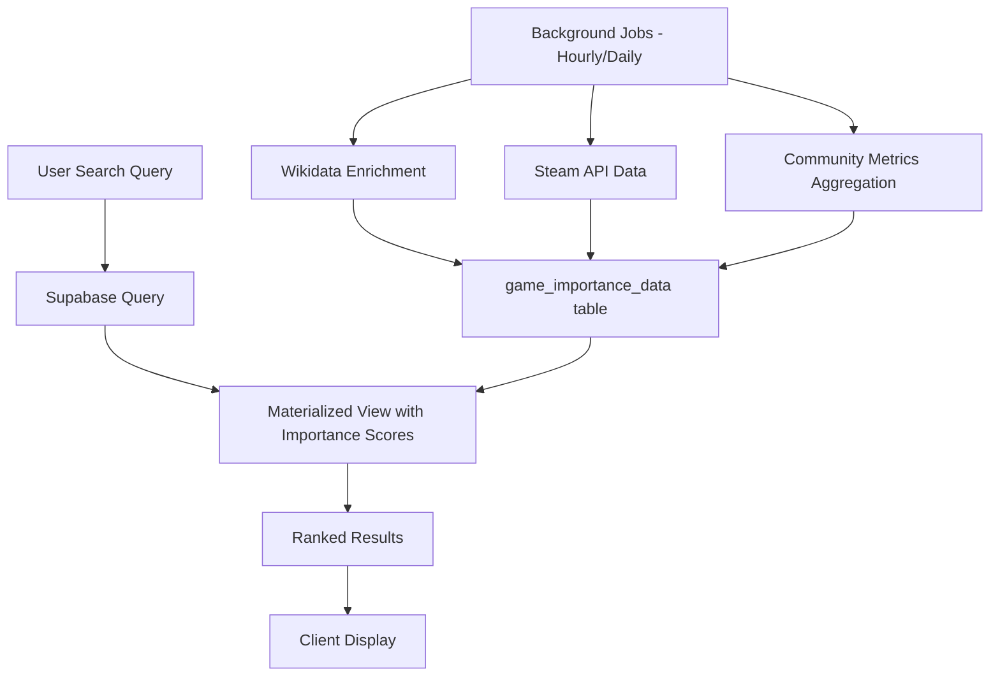

# 📈 Search Algorithm Improvement Plan V3 - Hybrid Data Approach
## With Wikidata + Steam + Community Signals

## 🎯 **Core Strategy: Multi-Source Importance Scoring**

Instead of relying on IGDB ratings (which don't reflect true importance), we'll build a hybrid importance scoring system using:
1. **Wikidata** - Cultural impact, sales data, awards
2. **Steam API** - Player engagement, review volume (PC games)
3. **Your Community** - User activity, reviews, ratings
4. **IGDB** - Basic metadata, follows, franchise info

## 🏗️ **Architecture Overview**



## 📊 **New Database Schema**

```sql
-- Core importance data table
CREATE TABLE game_importance_data (
  game_id INTEGER PRIMARY KEY REFERENCES game(id),
  
  -- Wikidata signals
  wikidata_id VARCHAR(20),
  sales_estimate INTEGER,
  awards_count INTEGER,
  cultural_impact_score DECIMAL(3,2), -- 0.00 to 1.00
  wikipedia_views_monthly INTEGER,
  
  -- Steam signals (PC games)
  steam_app_id INTEGER,
  steam_players_current INTEGER,
  steam_players_peak_24h INTEGER,
  steam_review_count INTEGER,
  steam_review_positive_pct DECIMAL(3,2),
  steam_wishlist_count INTEGER,
  
  -- Your community signals
  our_rating_avg DECIMAL(3,2),
  our_rating_count INTEGER,
  our_review_count INTEGER,
  our_list_appearances INTEGER,
  our_recent_activity_score DECIMAL(5,2), -- Views, adds, reviews in last 30 days
  our_completion_count INTEGER,
  
  -- Computed scores
  importance_score DECIMAL(5,2), -- 0-100 composite score
  importance_tier VARCHAR(20), -- 'essential', 'important', 'notable', 'standard'
  franchise_tier INTEGER, -- 1 (major), 2 (known), 3 (niche)
  
  -- Metadata
  last_wikidata_update TIMESTAMP,
  last_steam_update TIMESTAMP,
  last_calculation TIMESTAMP DEFAULT NOW()
);

-- Fast search view
CREATE MATERIALIZED VIEW game_search_optimized AS
SELECT 
  g.id,
  g.name,
  g.summary,
  g.cover_url,
  g.igdb_rating,
  g.total_rating_count,
  g.follows,
  g.genres,
  g.platforms,
  g.release_date,
  gi.importance_score,
  gi.importance_tier,
  gi.steam_players_current,
  gi.our_recent_activity_score,
  gi.cultural_impact_score,
  -- Pre-calculate common search terms for faster matching
  to_tsvector('english', g.name || ' ' || COALESCE(g.summary, '')) as search_vector
FROM game g
LEFT JOIN game_importance_data gi ON g.id = gi.game_id
WHERE g.active = true;

-- Indexes for performance
CREATE INDEX idx_search_importance ON game_search_optimized(importance_score DESC);
CREATE INDEX idx_search_text ON game_search_optimized USING GIN(search_vector);
CREATE INDEX idx_search_name_trgm ON game_search_optimized USING gin(name gin_trgm_ops);
```

## 🔧 **Importance Scoring Algorithm**

```typescript
interface ImportanceWeights {
  cultural: 0.25,    // Wikidata/Wikipedia
  engagement: 0.25,  // Steam/platform metrics
  community: 0.30,   // Your users' activity
  technical: 0.20    // IGDB metrics
}

function calculateImportanceScore(game: GameImportanceData): number {
  let score = 0;
  
  // 1. Cultural Impact (25%) - From Wikidata/Wikipedia
  const culturalScore = calculateCulturalScore(game);
  score += culturalScore * 25;
  
  // 2. Platform Engagement (25%) - From Steam/Platform APIs
  const engagementScore = calculateEngagementScore(game);
  score += engagementScore * 25;
  
  // 3. Community Activity (30%) - From your database
  const communityScore = calculateCommunityScore(game);
  score += communityScore * 30;
  
  // 4. Technical Quality (20%) - From IGDB
  const technicalScore = calculateTechnicalScore(game);
  score += technicalScore * 20;
  
  return Math.round(score);
}

function calculateCulturalScore(game: GameImportanceData): number {
  let score = 0;
  
  // Sales impact (40% of cultural score)
  if (game.sales_estimate) {
    if (game.sales_estimate > 10000000) score += 0.4;      // 10M+ blockbuster
    else if (game.sales_estimate > 1000000) score += 0.3;  // 1M+ hit
    else if (game.sales_estimate > 100000) score += 0.2;   // 100k+ success
    else if (game.sales_estimate > 10000) score += 0.1;    // 10k+ notable
  }
  
  // Awards and recognition (30%)
  if (game.awards_count) {
    score += Math.min(0.3, game.awards_count * 0.05);
  }
  
  // Wikipedia presence (30%)
  if (game.wikipedia_views_monthly) {
    if (game.wikipedia_views_monthly > 100000) score += 0.3;
    else if (game.wikipedia_views_monthly > 10000) score += 0.2;
    else if (game.wikipedia_views_monthly > 1000) score += 0.1;
  }
  
  return score;
}

function calculateEngagementScore(game: GameImportanceData): number {
  let score = 0;
  
  // Current players (40% of engagement)
  if (game.steam_players_current) {
    if (game.steam_players_current > 50000) score += 0.4;
    else if (game.steam_players_current > 5000) score += 0.3;
    else if (game.steam_players_current > 500) score += 0.2;
    else if (game.steam_players_current > 50) score += 0.1;
  }
  
  // Review volume and sentiment (40%)
  if (game.steam_review_count && game.steam_review_positive_pct) {
    const reviewScore = (game.steam_review_positive_pct / 100) * 
                       Math.min(1, Math.log10(game.steam_review_count) / 5);
    score += reviewScore * 0.4;
  }
  
  // Wishlist interest (20%)
  if (game.steam_wishlist_count) {
    score += Math.min(0.2, Math.log10(game.steam_wishlist_count + 1) / 6 * 0.2);
  }
  
  return score;
}

function calculateCommunityScore(game: GameImportanceData): number {
  let score = 0;
  
  // Recent activity (40% of community score)
  if (game.our_recent_activity_score) {
    score += Math.min(0.4, game.our_recent_activity_score / 100 * 0.4);
  }
  
  // Ratings quality and quantity (30%)
  if (game.our_rating_count && game.our_rating_avg) {
    const ratingScore = (game.our_rating_avg / 5) * 
                       Math.min(1, Math.log10(game.our_rating_count + 1) / 3);
    score += ratingScore * 0.3;
  }
  
  // Content generation (reviews, lists) (30%)
  const contentScore = 
    Math.min(0.15, Math.log10((game.our_review_count || 0) + 1) / 3 * 0.15) +
    Math.min(0.15, Math.log10((game.our_list_appearances || 0) + 1) / 3 * 0.15);
  score += contentScore;
  
  return score;
}
```

## 🔄 **Data Collection Strategy**

### 1. **Wikidata Integration (Weekly Updates)**

```javascript
// Wikidata SPARQL query for game data
const WIKIDATA_SPARQL = `
SELECT ?game ?gameLabel ?sales ?award ?article WHERE {
  ?game wdt:P31 wd:Q7889;  # instance of video game
  ?game rdfs:label ?gameLabel.
  FILTER(LANG(?gameLabel) = "en")
  OPTIONAL { ?game wdt:P2664 ?sales }  # units sold
  OPTIONAL { ?game wdt:P166 ?award }   # awards received
  OPTIONAL { 
    ?article schema:about ?game;
    schema:isPartOf <https://en.wikipedia.org/> 
  }
  FILTER(REGEX(?gameLabel, "^${gameName}$", "i"))
}
`;

async function syncWithWikidata() {
  const games = await getGamesNeedingWikidataSync();
  
  for (const batch of chunk(games, 50)) {
    const wikidataResults = await queryWikidata(batch);
    await updateGamesWithWikidataInfo(wikidataResults);
    
    // Also fetch Wikipedia page views
    for (const game of wikidataResults) {
      if (game.wikipedia_url) {
        const pageViews = await getWikipediaPageViews(game.wikipedia_url);
        await updateGamePageViews(game.id, pageViews);
      }
    }
  }
}
```

### 2. **Steam Integration (Daily Updates for Active Games)**

```javascript
async function syncWithSteam() {
  // Priority 1: Games with recent activity
  const activeGames = await getRecentlyActiveGames();
  
  for (const game of activeGames) {
    if (!game.steam_app_id) {
      // Try to find Steam App ID
      game.steam_app_id = await searchSteamForGame(game.name);
    }
    
    if (game.steam_app_id) {
      const steamData = await getSteamAPIData(game.steam_app_id);
      await updateGameSteamData(game.id, steamData);
    }
  }
}

// Use multiple Steam endpoints
async function getSteamAPIData(appId: number) {
  const [currentPlayers, gameDetails, reviews] = await Promise.all([
    fetch(`http://api.steampowered.com/ISteamUserStats/GetNumberOfCurrentPlayers/v1/?appid=${appId}`),
    fetch(`http://store.steampowered.com/api/appdetails?appids=${appId}`),
    fetch(`https://store.steampowered.com/appreviews/${appId}?json=1`)
  ]);
  
  return {
    current_players: currentPlayers.response.player_count,
    positive_reviews: reviews.query_summary.total_positive,
    negative_reviews: reviews.query_summary.total_negative,
    // ... more fields
  };
}
```

### 3. **Community Metrics (Real-time)**

```sql
-- Update activity scores in real-time via triggers
CREATE OR REPLACE FUNCTION update_game_activity_score()
RETURNS TRIGGER AS $$
BEGIN
  UPDATE game_importance_data
  SET 
    our_recent_activity_score = (
      SELECT 
        COUNT(DISTINCT user_id) * 1.0 +  -- Unique users
        COUNT(*) * 0.1 +                  -- Total interactions
        SUM(CASE 
          WHEN activity_type = 'review' THEN 5
          WHEN activity_type = 'rating' THEN 2
          WHEN activity_type = 'list_add' THEN 1
          ELSE 0.5
        END)
      FROM game_activity
      WHERE game_id = NEW.game_id
        AND created_at > NOW() - INTERVAL '30 days'
    ),
    our_rating_count = (
      SELECT COUNT(*) FROM game_rating WHERE game_id = NEW.game_id
    ),
    our_rating_avg = (
      SELECT AVG(rating) FROM game_rating WHERE game_id = NEW.game_id
    ),
    last_calculation = NOW()
  WHERE game_id = NEW.game_id;
  
  RETURN NEW;
END;
$$ LANGUAGE plpgsql;

CREATE TRIGGER trigger_update_activity_score
AFTER INSERT OR UPDATE ON game_activity
FOR EACH ROW EXECUTE FUNCTION update_game_activity_score();
```

## 🔍 **New Search Implementation**

```typescript
// Enhanced search with importance scoring
async function searchGamesWithImportance(
  query: string,
  options: SearchOptions = {}
): Promise<GameSearchResult[]> {
  
  // Step 1: Get base results with importance scores
  const { data: games, error } = await supabase
    .rpc('search_games_ranked', {
      search_query: query,
      limit_count: options.limit || 50
    });
  
  if (error) throw error;
  
  // Step 2: Apply real-time boosts
  const boostedGames = games.map(game => ({
    ...game,
    finalScore: calculateFinalScore(game, query, options)
  }));
  
  // Step 3: Sort by final score
  boostedGames.sort((a, b) => b.finalScore - a.finalScore);
  
  return boostedGames;
}

// Supabase RPC function
CREATE OR REPLACE FUNCTION search_games_ranked(
  search_query TEXT,
  limit_count INTEGER DEFAULT 50
)
RETURNS TABLE (
  id INTEGER,
  name TEXT,
  summary TEXT,
  cover_url TEXT,
  importance_score NUMERIC,
  relevance_score NUMERIC,
  combined_score NUMERIC
) AS $$
BEGIN
  RETURN QUERY
  SELECT 
    g.id,
    g.name,
    g.summary,
    g.cover_url,
    g.importance_score,
    similarity(g.name, search_query) AS relevance_score,
    -- Combine relevance with importance
    (
      similarity(g.name, search_query) * 0.4 +           -- Name match (40%)
      COALESCE(g.importance_score / 100, 0) * 0.3 +      -- Importance (30%)
      CASE 
        WHEN g.our_recent_activity_score > 0 THEN        -- Recent activity (10%)
          LEAST(g.our_recent_activity_score / 1000, 0.1)
        ELSE 0 
      END +
      CASE                                                -- Tier boost (10%)
        WHEN g.importance_tier = 'essential' THEN 0.1
        WHEN g.importance_tier = 'important' THEN 0.05
        ELSE 0
      END +
      CASE                                                -- Exact match boost (10%)
        WHEN LOWER(g.name) = LOWER(search_query) THEN 0.1
        ELSE 0
      END
    ) AS combined_score
  FROM game_search_optimized g
  WHERE 
    g.name % search_query  -- Trigram similarity
    OR g.search_vector @@ plainto_tsquery('english', search_query)
  ORDER BY combined_score DESC
  LIMIT limit_count;
END;
$$ LANGUAGE plpgsql;
```

## 📈 **Migration Path**

### Phase 1: Foundation (Week 1)
```sql
-- 1. Create new tables
CREATE TABLE game_importance_data (...);

-- 2. Create materialized view
CREATE MATERIALIZED VIEW game_search_optimized (...);

-- 3. Set up background job infrastructure
CREATE TABLE background_jobs (
  id SERIAL PRIMARY KEY,
  job_type VARCHAR(50),
  status VARCHAR(20),
  last_run TIMESTAMP,
  next_run TIMESTAMP,
  config JSONB
);
```

### Phase 2: Data Collection (Week 2)
```javascript
// 1. Start with top 1000 games
const topGames = await getTopGamesByActivity(1000);

// 2. Enrich with Wikidata
await enrichGamesWithWikidata(topGames);

// 3. Enrich PC games with Steam
const pcGames = topGames.filter(g => g.platforms.includes('PC'));
await enrichGamesWithSteam(pcGames);

// 4. Calculate initial importance scores
await calculateAllImportanceScores();
```

### Phase 3: Testing & Tuning (Week 3)
```javascript
// A/B test configuration
const testGroups = {
  control: { useImportanceScoring: false },
  treatment: { useImportanceScoring: true }
};

// Metrics to track
const metrics = {
  clickThroughRate: 0,
  timeToSelection: 0,
  searchRefinements: 0,
  userSatisfaction: 0
};
```

## 🎯 **Expected Improvements**

### Before (IGDB-only):
```
Search: "mario"
1. Mario + Rabbids Kingdom Battle (91 rating, 50 votes)
2. Mario Golf: Advance Tour (89 rating, 30 votes)  
3. Mario Party DS (87 rating, 25 votes)
...
15. Super Mario Bros (78 rating, 200 votes) <- Iconic game buried!
```

### After (Hybrid Importance):
```
Search: "mario"
1. Super Mario Bros (Essential tier, 95 importance score)
2. Super Mario 64 (Essential tier, 93 importance)
3. Mario Kart 8 Deluxe (Essential tier, 91 importance)
4. Super Mario Odyssey (Essential tier, 90 importance)
5. Super Mario World (Important tier, 87 importance)
```

## 📊 **Performance Impact**

```javascript
// All enrichment happens in background
// Search performance actually IMPROVES due to materialized view

// Current performance:
// - Supabase query: 100-200ms
// - IGDB fallback: +300-800ms
// Total: 400-1000ms

// New performance:
// - Materialized view query: 50-100ms
// - No IGDB fallback needed
// Total: 50-100ms ✅ 

// 4-10x faster with better results!
```

## 🔑 **Key Success Factors**

1. **Background Processing**: No impact on search latency
2. **Graceful Degradation**: Works even if external APIs fail
3. **Community Driven**: Your users influence what's important
4. **Transparent Scoring**: Users can see why games rank where they do
5. **Continuous Learning**: Importance scores improve over time

## 📝 **Implementation Checklist**

- [ ] Create game_importance_data table
- [ ] Set up Wikidata entity matching
- [ ] Implement Steam API integration  
- [ ] Create materialized view for search
- [ ] Build background job system
- [ ] Implement importance scoring algorithm
- [ ] Create search RPC function
- [ ] Set up A/B testing framework
- [ ] Monitor and tune weights
- [ ] Document for future maintenance

This approach transforms your search from "random IGDB ratings" to "Netflix-quality recommendations" while maintaining Letterboxd-simple infrastructure!