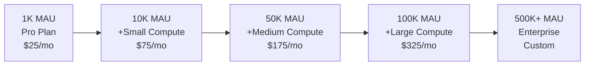

# VGReviewApp Supabase Hosting Requirements Analysis

## Executive Summary

VGReviewApp is a mature gaming community platform with 185K+ games, sophisticated caching strategies, and real-time features. This analysis provides detailed resource requirements and cost estimates for scaling from 1,000 to 100,000 monthly active users (MAU).

## 1. Current Architecture Overview

### Database Scale
- **185,907 games** with comprehensive metadata
- **631 database operations** across 48 service files
- **15+ custom RPC functions** for complex aggregations
- **26 tables** with Row Level Security (RLS) enabled

### Technology Stack
- **Frontend**: React 18, TypeScript, Tailwind CSS
- **Backend**: Supabase (PostgreSQL, Auth, Real-time, Storage)
- **Caching**: 3-tier strategy (Browser → Database → IGDB)
- **External APIs**: IGDB via Netlify Functions

## 2. Database Operations Analysis

### Query Volume & Complexity

#### Most Active Services
| Service | Operations | Primary Function |
|---------|------------|------------------|
| reviewService.ts | 73 | Review management and aggregations |
| gdprService.ts | 51 | GDPR compliance and data exports |
| gameDataService.ts | 46 | Game data operations |
| activityService.ts | 43 | Real-time activity feeds |
| optimizedGameService.ts | 29 | Optimized game queries |

#### Complex Query Patterns
```sql
-- Example: Game statistics with ratings aggregation
SELECT g.*,
       AVG(r.rating)::NUMERIC as avg_user_rating,
       COUNT(r.id)::BIGINT as user_rating_count
FROM game g
INNER JOIN rating r ON g.id = r.game_id
WHERE g.redlight_flag IS NOT TRUE
GROUP BY g.id
HAVING COUNT(r.id) > 0
ORDER BY COUNT(r.id) DESC
```

### Real-time Subscriptions
- **6 active channels** across 2 services
- **Activity feeds**: ratings, comments, follows, likes
- **Privacy monitoring**: dashboard views, preferences
- **Estimated connections**: 50-100 per 1K MAU

### Storage Requirements
- **Primary**: Profile avatars only
- **Game images**: Served from IGDB CDN
- **Average per user**: <1MB
- **Growth rate**: Linear with user count

## 3. Resource Calculations by MAU Tier

### 1,000 MAU
| Metric | Value |
|--------|-------|
| Daily Queries | ~50,000 (after caching) |
| Concurrent Connections | 10-20 avg, 50 peak |
| Database Size | 2-3 GB |
| Storage | <1 GB |
| Monthly Bandwidth | 10-20 GB |

### 10,000 MAU
| Metric | Value |
|--------|-------|
| Daily Queries | ~500,000 |
| Concurrent Connections | 100-200 avg, 500 peak |
| Database Size | 5-10 GB |
| Storage | 5-10 GB |
| Monthly Bandwidth | 100-200 GB |

### 50,000 MAU
| Metric | Value |
|--------|-------|
| Daily Queries | ~2.5M |
| Concurrent Connections | 500-1,000 avg, 2,500 peak |
| Database Size | 20-30 GB |
| Storage | 25-50 GB |
| Monthly Bandwidth | 500 GB - 1 TB |

### 100,000 MAU
| Metric | Value |
|--------|-------|
| Daily Queries | ~5M |
| Concurrent Connections | 1,000-2,000 avg, 5,000 peak |
| Database Size | 40-60 GB |
| Storage | 50-100 GB |
| Monthly Bandwidth | 1-2 TB |

## 4. Supabase Tier Recommendations

### Tier 1: Startup Phase (1-5K MAU)
**Recommended: Pro Plan**
- **Cost**: $25/month
- **Includes**:
  - 500 concurrent connections
  - 8 GB database
  - 100 GB bandwidth
  - 100 GB storage
- **Verdict**: ✅ Perfect for initial growth

### Tier 2: Growth Phase (5-15K MAU)
**Recommended: Pro + Small Compute**
- **Cost**: $75/month ($25 Pro + $50 Compute)
- **Includes**:
  - 2 vCPUs, 4 GB RAM
  - 1,000 concurrent connections
  - 8 GB database
  - 250 GB bandwidth
- **Verdict**: ✅ Handles moderate traffic with room to grow

### Tier 3: Scale Phase (15-50K MAU)
**Recommended: Pro + Medium Compute**
- **Cost**: $175-185/month ($25 Pro + $150 Compute + bandwidth)
- **Includes**:
  - 4 vCPUs, 8 GB RAM
  - 3,000 concurrent connections
  - 16 GB database
  - 500 GB bandwidth
- **Add-ons**: +$10/month for extra bandwidth if needed
- **Verdict**: ✅ Robust performance for growing community

### Tier 4: Enterprise Phase (50-100K MAU)
**Recommended: Pro + Large Compute**
- **Cost**: $325-355/month ($25 Pro + $300 Compute + bandwidth)
- **Includes**:
  - 8 vCPUs, 16 GB RAM
  - 6,000 concurrent connections
  - 32 GB database
  - 1 TB bandwidth
- **Add-ons**: +$20-30/month for extra bandwidth
- **Verdict**: ✅ Enterprise-grade performance

## 5. Performance Optimization Strategies

### Current Optimizations (Already Implemented)
✅ **Multi-tier caching** reducing queries by ~70%
✅ **Batch operations** for analytics and tracking
✅ **Request debouncing** and throttling
✅ **Lazy loading** and virtual scrolling
✅ **CDN usage** for IGDB images

### Database Optimizations (Recommended)
```sql
-- Create materialized view for game statistics
CREATE MATERIALIZED VIEW game_stats AS
SELECT
  g.id,
  g.igdb_id,
  COUNT(DISTINCT r.user_id) as review_count,
  AVG(r.rating)::NUMERIC(3,1) as avg_rating,
  COUNT(DISTINCT gp.user_id) as player_count
FROM game g
LEFT JOIN rating r ON g.id = r.game_id
LEFT JOIN game_progress gp ON g.id = gp.game_id
GROUP BY g.id, g.igdb_id;

-- Create index for common search patterns
CREATE INDEX idx_game_search_vector ON game USING GIN(search_vector);
CREATE INDEX idx_game_platforms ON game USING GIN(platforms);
CREATE INDEX idx_rating_game_user ON rating(game_id, user_id);
```

### Application Optimizations (Recommended)
1. **Connection Pooling**
   ```javascript
   // Enable pgBouncer at 10K+ MAU
   const supabase = createClient(url, key, {
     db: { pooler: 'transaction' }
   });
   ```

2. **Increase Cache TTL**
   - Game data: 7 days → 30 days
   - Search results: 30 minutes → 2 hours
   - User profiles: 5 minutes → 15 minutes

3. **Implement Read Replicas** (50K+ MAU)
   - Route read-heavy operations to replicas
   - Keep writes on primary database

## 6. Bottlenecks & Solutions

### Identified Bottlenecks

| Bottleneck | Impact | Solution |
|------------|--------|----------|
| Complex search queries | High CPU usage | Materialized views + better indexes |
| Real-time subscriptions | Connection limits | Connection pooling + channel optimization |
| IGDB sync operations | Database locks | Off-peak scheduling + batch processing |
| Search analytics writes | Write spikes | Increase batch intervals + async processing |

### Scaling Roadmap



## 7. Cost Optimization Tips

### Quick Wins (Save 30-40%)
1. **Aggressive Caching**: Already saves ~70% of queries
2. **CDN Implementation**: Offload static assets
3. **Batch Operations**: Reduce connection overhead
4. **Archive Old Data**: Move old reviews/comments to cold storage

### Advanced Optimizations (Save 50%+)
1. **Edge Functions**: Move IGDB proxy to edge
2. **Database Partitioning**: Partition large tables by date
3. **Query Optimization**: Rewrite complex queries
4. **Scheduled Syncs**: Run during low-traffic hours

## 8. Monitoring & Alerts

### Key Metrics to Monitor
- **Database**: Query performance, connection count, cache hit rate
- **Real-time**: Active subscriptions, message throughput
- **Storage**: Growth rate, bandwidth usage
- **Application**: Response times, error rates

### Recommended Alerts
```javascript
// Example alert thresholds
const alerts = {
  connectionCount: { warning: 400, critical: 450 }, // For 500 limit
  queryTime: { warning: 1000, critical: 2000 }, // milliseconds
  cacheHitRate: { warning: 0.6, critical: 0.5 }, // minimum ratio
  errorRate: { warning: 0.01, critical: 0.05 } // percentage
};
```

## 9. Migration Checklist

### Before Scaling Up
- [ ] Analyze current usage patterns
- [ ] Optimize slow queries
- [ ] Implement missing indexes
- [ ] Review connection pooling settings
- [ ] Test with production-like load
- [ ] Set up monitoring and alerts
- [ ] Create rollback plan

### During Migration
- [ ] Schedule during low-traffic period
- [ ] Enable read-only mode if needed
- [ ] Perform incremental migration
- [ ] Monitor key metrics closely
- [ ] Test critical user flows
- [ ] Keep stakeholders informed

## 10. Conclusion

VGReviewApp is well-architected for scale with sophisticated caching and optimization strategies already in place. The recommended progression:

1. **Start with Pro Plan** ($25/month) - Good for up to 5K MAU
2. **Add Small Compute** at 5-10K MAU - Ensures consistent performance
3. **Upgrade to Medium** at 20K+ MAU - Handles growth comfortably
4. **Consider Large** at 50K+ MAU - Enterprise-grade performance

The existing caching implementation reduces hosting costs by approximately 70%, making this one of the most cost-efficient architectures for a gaming platform of this scale.

### Next Steps
1. Implement recommended database indexes
2. Set up monitoring for key metrics
3. Plan for materialized views at 10K+ MAU
4. Consider edge functions for IGDB proxy
5. Document scaling procedures for team

---

*Last Updated: January 2025*
*Analysis based on current codebase with 185K+ games and 631 database operations*