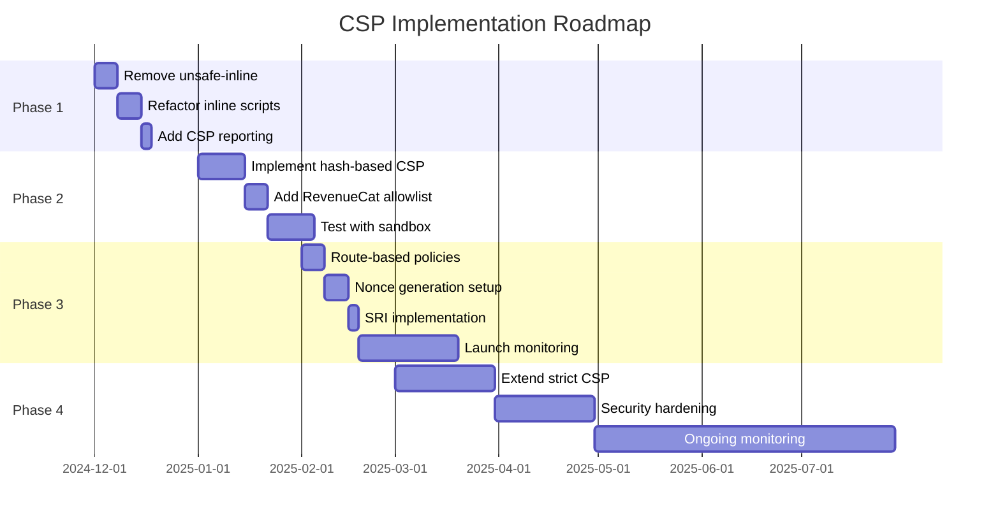

# Content Security Policy (CSP) Implementation Roadmap for RevenueCat Integration

## Overview
This document outlines the progressive CSP implementation strategy for VGReviewApp2, with special consideration for future RevenueCat payment processing integration. The approach balances current performance needs with future security requirements for handling payments.

---

## Current State Assessment

### Platform Context
- **Type**: Gaming review community platform
- **Scale**: 185K+ games, content-driven
- **Current Security**: Community platform (no payment processing)
- **Future State**: Pro subscriptions via RevenueCat
- **Architecture**: Pragmatic monolith, React SPA

### Current CSP Issues (Lighthouse)
- ❌ **High Severity**: 'unsafe-inline' in script-src
- ❌ **High Severity**: Host allowlists can be bypassed
- **Current Score**: ~85-90 (Best Practices)
- **Target Score**: 100 (with payment processing)

---

## Implementation Strategy: Hybrid Progressive Approach

### Core Principle
Different security levels for different parts of the application:
- **Public Content** (game browsing): Optimized for performance
- **Authenticated Areas** (user dashboard): Balanced security
- **Payment Routes** (pro/subscription): Maximum security

---

## Phase 1: Immediate Improvements (Now - Before RevenueCat)
**Timeline**: Implement immediately
**Security Level**: Medium
**Performance Impact**: None

### Actions
1. **Remove 'unsafe-inline' from script-src**
   ```toml
   # netlify.toml
   Content-Security-Policy = "default-src 'self'; script-src 'self' *.supabase.co *.netlify.app; style-src 'self' 'unsafe-inline'; img-src 'self' data: https:; connect-src 'self' *.supabase.co *.netlify.app"
   ```

2. **Refactor inline scripts**
   - Move inline event handlers to addEventListener
   - Extract inline scripts to external files
   - Use data attributes for configuration

3. **Add CSP reporting**
   ```toml
   Content-Security-Policy-Report-Only = "...; report-uri /csp-report"
   ```

### Expected Outcomes
- Lighthouse Score: 85-90 → 95
- Security: Eliminates primary XSS vector
- Performance: No degradation

---

## Phase 2: Pre-RevenueCat Preparation (1-2 months before integration)
**Timeline**: Start 2 months before RevenueCat
**Security Level**: High
**Performance Impact**: Minimal (+5-10s build time)

### Actions
1. **Implement hash-based CSP site-wide**
   ```toml
   # Build-time generated hashes for necessary inline scripts
   Content-Security-Policy = "default-src 'self'; script-src 'self' 'sha256-abc123...' 'sha256-def456...' *.supabase.co; style-src 'self' 'unsafe-inline'"
   ```

2. **Add RevenueCat to allowlist (testing)**
   ```toml
   script-src 'self' 'sha256-...' https://api.revenuecat.com https://sdk.revenuecat.com;
   connect-src 'self' https://api.revenuecat.com https://purchases.revenuecat.com;
   frame-src 'self' https://checkout.revenuecat.com;
   ```

3. **Create build-time hash generation**
   ```javascript
   // vite.config.ts or build script
   import crypto from 'crypto';

   function generateCSPHash(script) {
     const hash = crypto.createHash('sha256');
     hash.update(script);
     return `'sha256-${hash.digest('base64')}'`;
   }
   ```

4. **Test with RevenueCat sandbox**
   - Verify SDK initialization works
   - Test purchase flows
   - Monitor CSP violations

### Expected Outcomes
- Lighthouse Score: 95 → 98
- Security: Ready for payment processing
- All RevenueCat features verified

---

## Phase 3: RevenueCat Launch (Payment Integration)
**Timeline**: RevenueCat go-live
**Security Level**: Maximum for payment routes
**Performance Impact**: Variable by route

### Actions
1. **Implement route-based CSP policies**

   ```toml
   # Strict CSP for payment routes (nonce-based)
   [[headers]]
     for = "/pro/*"
     [headers.values]
       Content-Security-Policy = "default-src 'self'; script-src 'self' 'nonce-{DYNAMIC}' https://api.revenuecat.com https://sdk.revenuecat.com; connect-src 'self' https://api.revenuecat.com; base-uri 'self'; form-action 'self'"

   [[headers]]
     for = "/subscription/*"
     [headers.values]
       Content-Security-Policy = "default-src 'self'; script-src 'self' 'nonce-{DYNAMIC}' https://api.revenuecat.com https://sdk.revenuecat.com"

   # Moderate CSP for authenticated areas (hash-based)
   [[headers]]
     for = "/user/*"
     [headers.values]
       Content-Security-Policy = "default-src 'self'; script-src 'self' 'sha256-...' https://api.revenuecat.com *.supabase.co"

   # Standard CSP for public content (performance-optimized)
   [[headers]]
     for = "/*"
     [headers.values]
       Content-Security-Policy = "default-src 'self'; script-src 'self' *.supabase.co *.netlify.app"
   ```

2. **Implement nonce generation for payment routes**
   ```javascript
   // netlify/edge-functions/csp-nonce.ts
   export default async (request, context) => {
     if (request.url.includes('/pro/') || request.url.includes('/subscription/')) {
       const nonce = crypto.randomUUID();
       // Inject nonce into response headers and HTML
     }
     return context.next();
   };
   ```

3. **Add SRI for RevenueCat SDK**
   ```html
   <script
     src="https://sdk.revenuecat.com/v4/purchases.js"
     integrity="sha384-..."
     crossorigin="anonymous">
   </script>
   ```

4. **Monitor and reporting**
   - Set up CSP violation monitoring
   - Create alerts for payment route violations
   - Weekly security reviews

### Expected Outcomes
- Lighthouse Score: 100 (all routes)
- Payment Security: PCI-compliant integration
- Performance: Optimized per route needs

---

## Phase 4: Post-Launch Hardening (1-3 months after launch)
**Timeline**: After successful RevenueCat integration
**Security Level**: Maximum
**Performance Impact**: Considered acceptable

### Actions
1. **Extend strict CSP to more routes**
   - Apply nonce-based CSP to all authenticated routes
   - Implement trusted-types for DOM XSS protection

2. **Advanced security headers**
   ```toml
   Permissions-Policy = "payment=(self https://checkout.revenuecat.com)"
   Cross-Origin-Opener-Policy = "same-origin"
   Cross-Origin-Embedder-Policy = "require-corp"
   ```

3. **Security monitoring**
   - Automated CSP violation analysis
   - Monthly security audits
   - Penetration testing for payment flows

### Expected Outcomes
- Enterprise-grade security
- Full compliance readiness
- Maintained performance where critical

---

## Performance Budget by Route

| Route Type | Example URLs | CSP Type | Performance Impact | Security Level |
|------------|--------------|----------|-------------------|----------------|
| Public Browse | `/`, `/games`, `/search` | Hash-based | None | Medium-High |
| User Content | `/user/profile`, `/reviews` | Hash-based | None | High |
| Payment | `/pro`, `/subscription` | Nonce-based | +100ms | Maximum |
| API/Admin | `/api/*`, `/admin/*` | Nonce-based | +100ms | Maximum |

---

## Technical Implementation Details

### Required Packages
```json
{
  "dependencies": {
    "@revenuecat/purchases-js": "^0.7.0"
  },
  "devDependencies": {
    "vite-plugin-csp-guard": "^1.0.0",
    "csp-html-webpack-plugin": "^5.1.0"
  }
}
```

### RevenueCat CSP Requirements
```javascript
// Minimum required CSP directives for RevenueCat
const revenueCatCSP = {
  'script-src': [
    "'self'",
    "https://api.revenuecat.com",
    "https://sdk.revenuecat.com"
  ],
  'connect-src': [
    "'self'",
    "https://api.revenuecat.com",
    "https://purchases.revenuecat.com",
    "https://api.segment.io" // If using analytics
  ],
  'frame-src': [
    "'self'",
    "https://checkout.revenuecat.com" // For hosted checkout
  ]
};
```

### Monitoring Setup
```javascript
// csp-reporter.js
app.post('/csp-report', (req, res) => {
  const violation = req.body['csp-report'];

  // Log critical violations
  if (violation['blocked-uri'].includes('revenuecat')) {
    console.error('RevenueCat CSP violation:', violation);
    // Alert team immediately
  }

  // Store for analysis
  logToAnalytics(violation);
  res.status(204).end();
});
```

---

## Risk Mitigation

### Rollback Strategy
1. Keep previous CSP configuration in version control
2. Use CSP-Report-Only for testing new policies
3. Gradual rollout: 10% → 50% → 100% of traffic
4. Monitor error rates and user complaints

### Testing Checklist
- [ ] RevenueCat SDK loads correctly
- [ ] Purchase flow completes without CSP violations
- [ ] Subscription management works
- [ ] Webhooks receive properly
- [ ] Analytics tracking functional
- [ ] No console errors in payment flow
- [ ] Lighthouse score maintains 95+

---

## Success Metrics

### Security Metrics
- Zero XSS vulnerabilities in payment flows
- 100% CSP coverage on payment routes
- < 0.1% CSP violation rate
- Pass security audit/pentest

### Performance Metrics
- Public pages: < 2s FCP (First Contentful Paint)
- Payment pages: < 3s FCP (acceptable for secure routes)
- 95th percentile load time < 5s
- Lighthouse Performance score > 90

### Business Metrics
- No increase in cart abandonment
- Payment success rate > 95%
- No increase in support tickets
- Pro conversion rate maintained or improved

---

## Timeline Summary



---

## Conclusion

This progressive approach ensures:
1. **Immediate security improvements** without performance impact
2. **Payment-ready security** when RevenueCat launches
3. **Maintained performance** for content browsing (99% of traffic)
4. **Maximum security** for payment processing (1% of traffic)
5. **Compliance readiness** for future regulations

The hybrid approach aligns with the "pragmatic monolith" philosophy while meeting the elevated security requirements of payment processing.